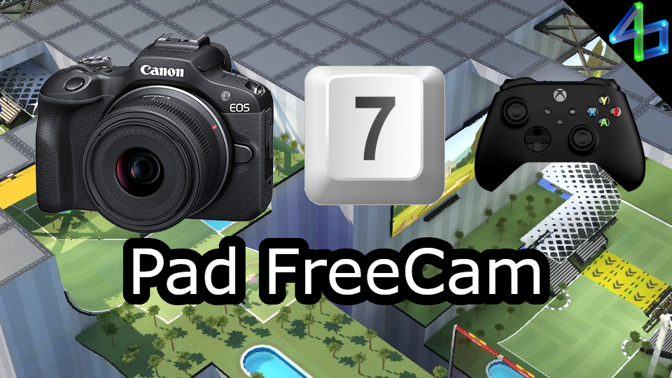

# Pad FreeCam

Allows you to control FreeCam (Cam 7) with a gamepad. Since there is no default camera 7 binding for a gamepad, it is advised that you set one, else you will need to reach up to your keyboard to enable it. This plugin will grab inputs from the first device connected that is not a mouse or keyboard, so for consistent functionality, you should only connect a single gamepad.

The camera moves similarly to how it normally would with mouse/keyboard, but does not yet ramp up speed. Since this plugin uses analog controls, you can simply move more slowly by moving the controls less.

The left stick is used to move as you normally would with the keyboard (forward/back/left/right). The right stick is used to pan the camera as you normally would with the mouse (up/down/left/right). The triggers are used to move vertically regardless of your camera direction (up/down).

There are configuration options such as swapping controls, setting a deadzone, setting the max speed, etc. with more coming in future updates.

<!--  -->
<!--  -->
<!--  -->

